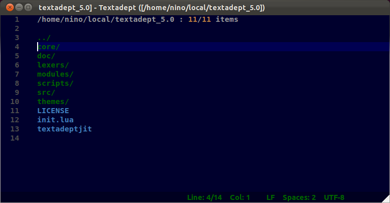
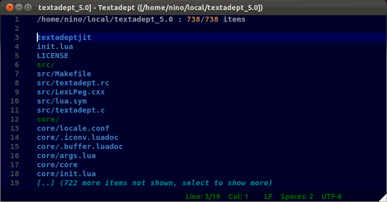
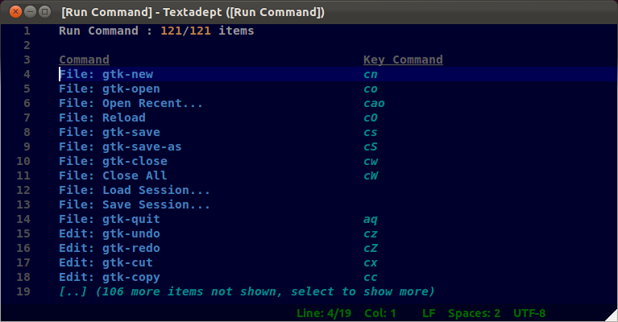

# Visual tour

Above you can see the open file screen for the TextAdept directory, displaying a
normal directory listing. To narrow the file list just type some characters.
To change to the parent directory either select the '`..`' entry or press
`backspace`.

Here is the same directory, but in snapopen mode. You can quickly toggle between
normal listing and snapopen mode by pressing `Ctrl + s`. Pressing `backspace` to
go to the parent directory works fine when in snapopen mode as well.

Here you can see fuzzy matching in action. Just type whatever you remember and
see what pops up. Should you get to many matching entries and need to narrow
further by matching on earlier parts on the paths, just add a space and type
in some additional search text.

The replacement buffer list. As the status bar says, you can close buffers
directly from within the list by pressing `Ctrl + d`. As opposed to the stock
buffer list you can also narrow entries by the directory name.

The above image shows nothing new interface-wise, but illustrates the use of
the TextRedux `hijack` module. When using the `hijack` module, TextRedux replaces
whatever it can of traditional interfaces with text based counterparts.
